# Diagramas - Módulo de Logs

## Visão Geral da Arquitetura

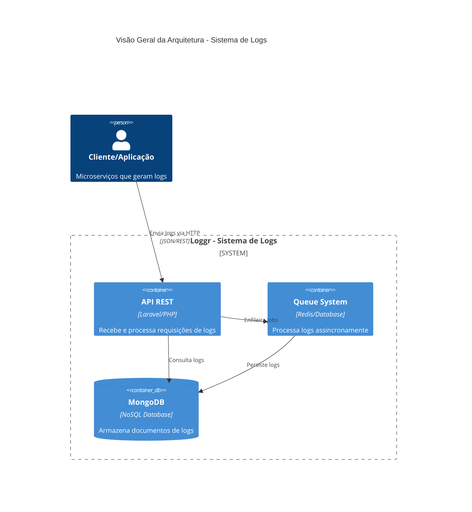

### Arquitetura em Camadas (Detalhada)

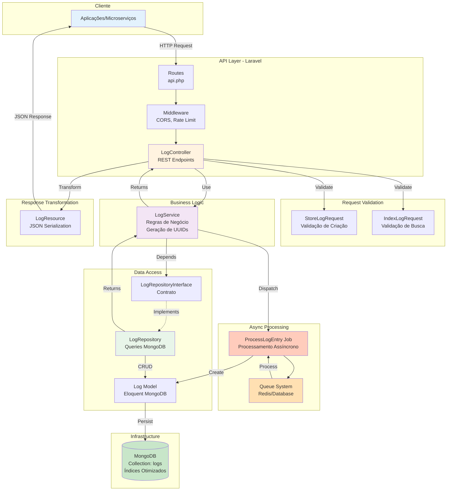

### Fluxo de Dados Completo

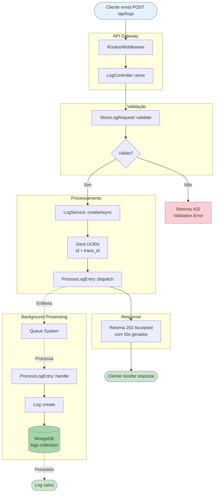

### Arquitetura de Microserviços (Contexto)

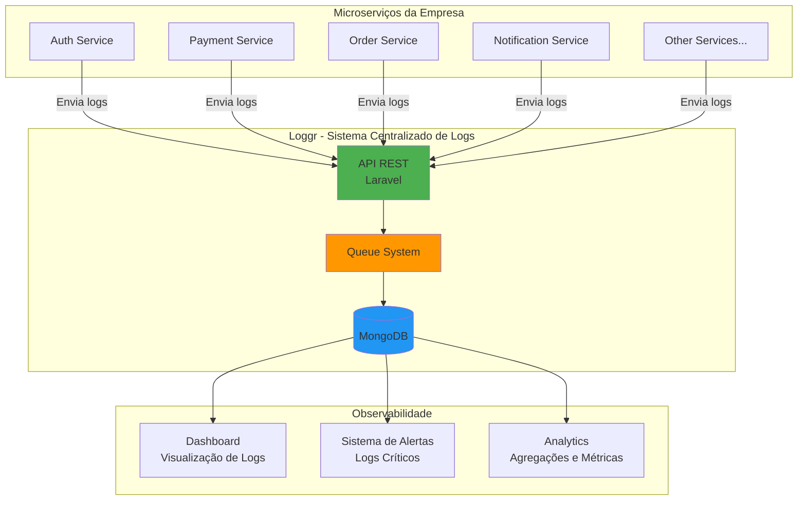

### Stack Tecnológica

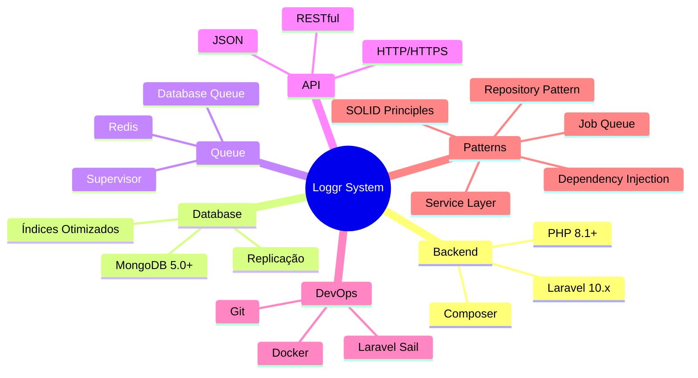

## Diagrama Entidade-Relacionamento (ER)

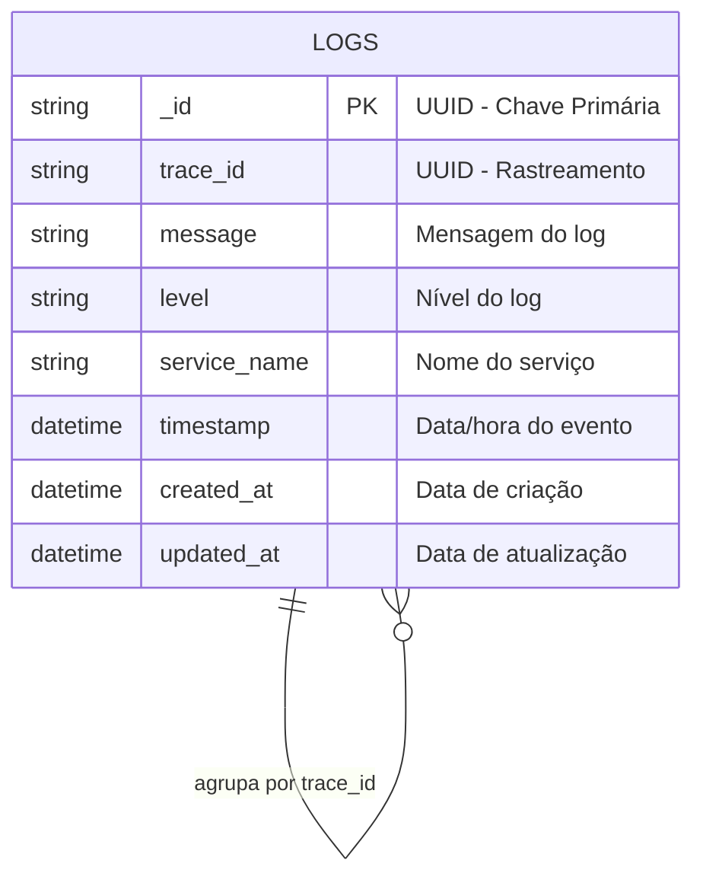

### Descrição dos Atributos

| Campo | Tipo | Descrição | Constraints |
|-------|------|-----------|-------------|
| `_id` | UUID (string) | Identificador único do log | PRIMARY KEY, NOT NULL, AUTO-GENERATED |
| `trace_id` | UUID (string) | ID para correlacionar logs relacionados | NOT NULL, INDEXED, AUTO-GENERATED |
| `message` | String | Mensagem descritiva do log | NOT NULL |
| `level` | Enum(string) | Nível de severidade | NOT NULL, ENUM: debug, info, notice, warning, error, critical, alert, emergency |
| `service_name` | String | Nome do serviço que gerou o log | NOT NULL, MAX: 255, INDEXED |
| `timestamp` | DateTime | Data e hora do evento logado | NULLABLE, INDEXED, DEFAULT: NOW() |
| `created_at` | DateTime | Data de criação do registro | AUTO, INDEXED |
| `updated_at` | DateTime | Data da última atualização | AUTO |

### Índices MongoDB

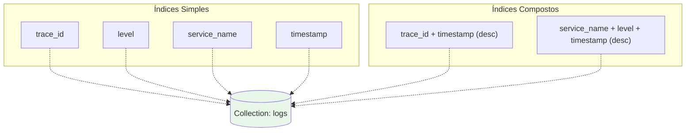

### Relacionamento por trace_id

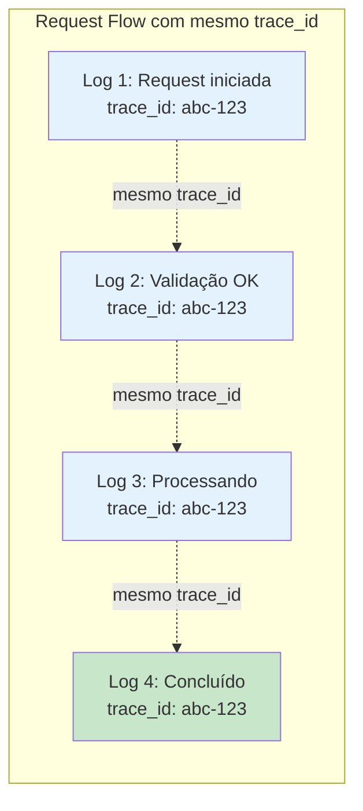

### Modelo de Dados MongoDB (Documento)

```json
{
  "_id": "7c9e6679-7425-40de-944b-e07fc1f90ae7",
  "trace_id": "550e8400-e29b-41d4-a716-446655440000",
  "message": "Usuário realizou login com sucesso",
  "level": "info",
  "service_name": "auth-service",
  "timestamp": {
    "$date": "2024-12-07T10:30:00.000Z"
  },
  "created_at": {
    "$date": "2024-12-07T10:30:01.234Z"
  },
  "updated_at": {
    "$date": "2024-12-07T10:30:01.234Z"
  }
}
```

### Cardinalidade

- **1 trace_id** pode ter **N logs** (relação 1:N)
- Permite rastrear todo o fluxo de uma requisição ou operação
- Logs são independentes, mas podem ser correlacionados via `trace_id`

### Queries Comuns

```javascript
// Buscar todos os logs de um trace específico
db.logs.find({ trace_id: "550e8400-e29b-41d4-a716-446655440000" })
  .sort({ timestamp: -1 })

// Buscar logs de erro de um serviço
db.logs.find({ 
  service_name: "payment-service",
  level: "error"
}).sort({ timestamp: -1 })

// Buscar logs em um período
db.logs.find({
  timestamp: {
    $gte: ISODate("2024-12-01T00:00:00Z"),
    $lte: ISODate("2024-12-07T23:59:59Z")
  }
}).sort({ timestamp: -1 })

// Agregação: contar logs por nível
db.logs.aggregate([
  { $group: { _id: "$level", count: { $sum: 1 } } },
  { $sort: { count: -1 } }
])

// Agregação: contar logs por serviço
db.logs.aggregate([
  { $group: { _id: "$service_name", count: { $sum: 1 } } },
  { $sort: { count: -1 } }
])
```

## Diagrama de Classes Completo

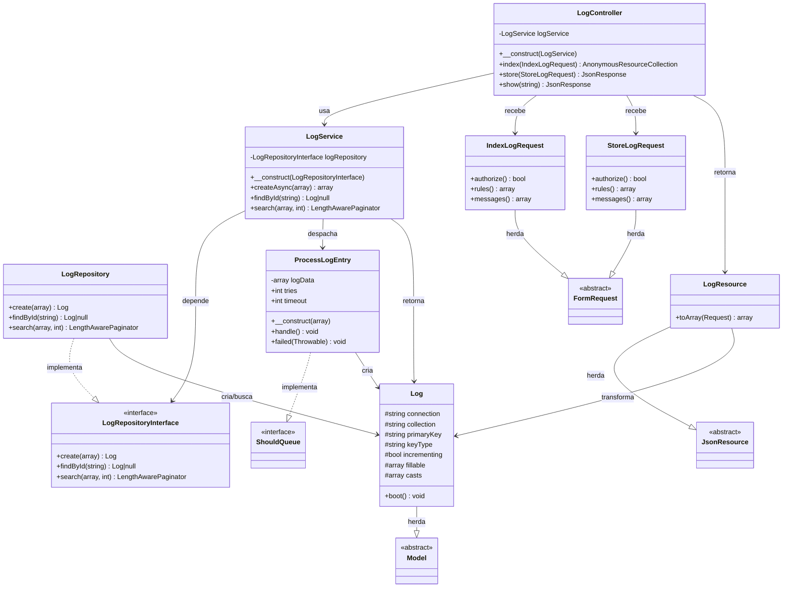

## Diagrama por Camadas

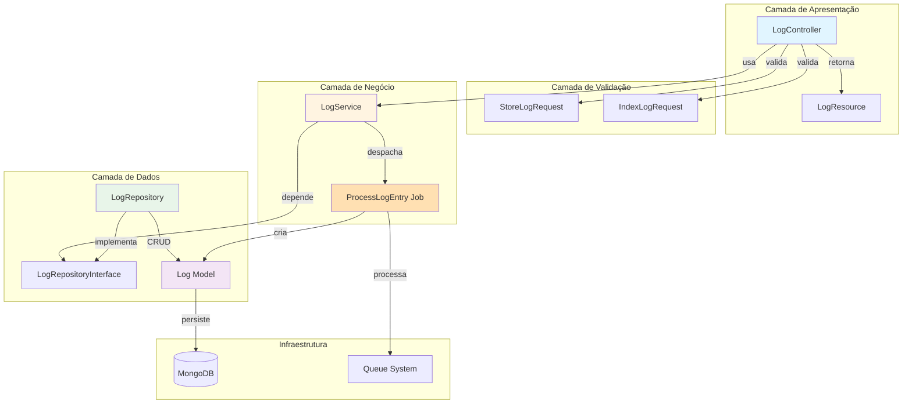

## Fluxo de Criação de Log (Assíncrono)

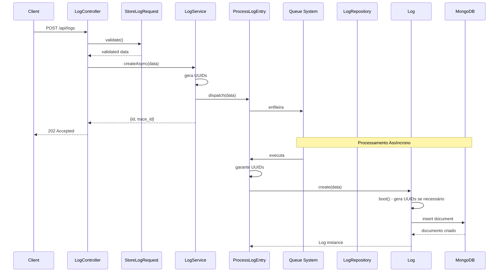

## Fluxo de Busca de Logs

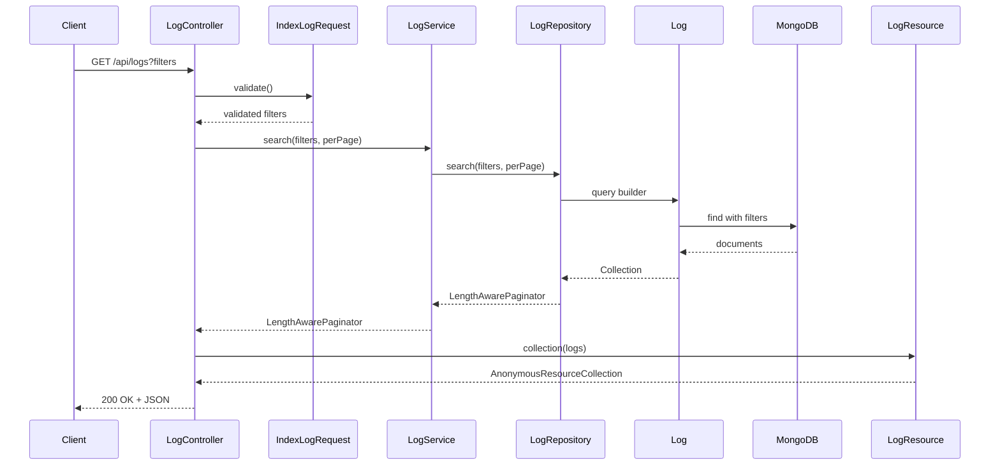

## Padrões de Design Utilizados

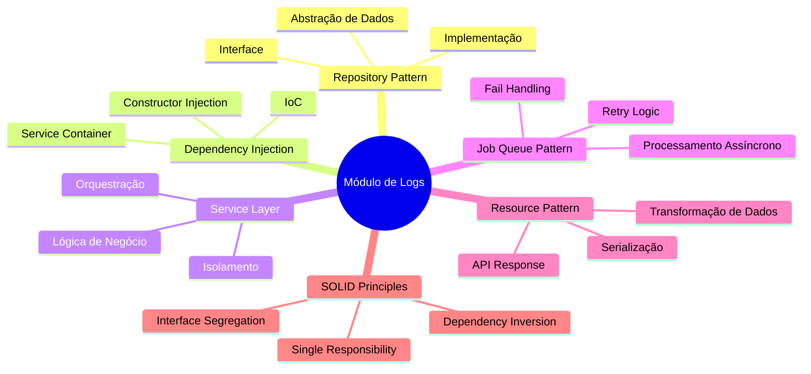

## Estrutura de Diretórios

```
app/
├── Http/
│   ├── Controllers/
│   │   └── LogController.php          # Controlador REST
│   ├── Requests/
│   │   ├── StoreLogRequest.php        # Validação de criação
│   │   └── IndexLogRequest.php        # Validação de busca
│   └── Resources/
│       └── LogResource.php            # Transformação de resposta
├── Services/
│   └── LogService.php                 # Lógica de negócio
├── Repositories/
│   ├── LogRepositoryInterface.php     # Contrato
│   └── LogRepository.php              # Implementação
├── Models/
│   └── Log.php                        # Model MongoDB
└── Jobs/
    └── ProcessLogEntry.php            # Job assíncrono
```

## Responsabilidades das Classes

### LogController
- Recebe requisições HTTP
- Valida entrada via Form Requests
- Delega operações ao Service
- Retorna respostas formatadas via Resources

### LogService
- Contém lógica de negócio
- Gera UUIDs antes de persistir
- Despacha jobs assíncronos
- Orquestra operações do Repository

### LogRepository
- Abstrai acesso aos dados
- Implementa queries no MongoDB
- Retorna Models ou Collections
- Aplica filtros de busca

### Log (Model)
- Representa entidade no MongoDB
- Define atributos e casts
- Gera UUIDs automaticamente (boot)
- Gerencia timestamps

### ProcessLogEntry (Job)
- Processa logs assincronamente
- Implementa retry logic (3 tentativas)
- Trata falhas
- Persiste no banco via Model

### Form Requests
- **StoreLogRequest**: Valida criação de logs
- **IndexLogRequest**: Valida filtros de busca

### LogResource
- Transforma Model em JSON
- Formata datas (ISO 8601)
- Expõe apenas campos necessários

## Injeção de Dependências

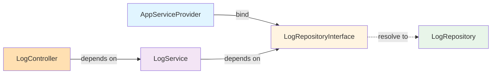

**Configuração no AppServiceProvider:**
```php
$this->app->bind(
    LogRepositoryInterface::class,
    LogRepository::class
);
```

Isso permite que o Laravel injete automaticamente a implementação correta quando `LogRepositoryInterface` for solicitada.
